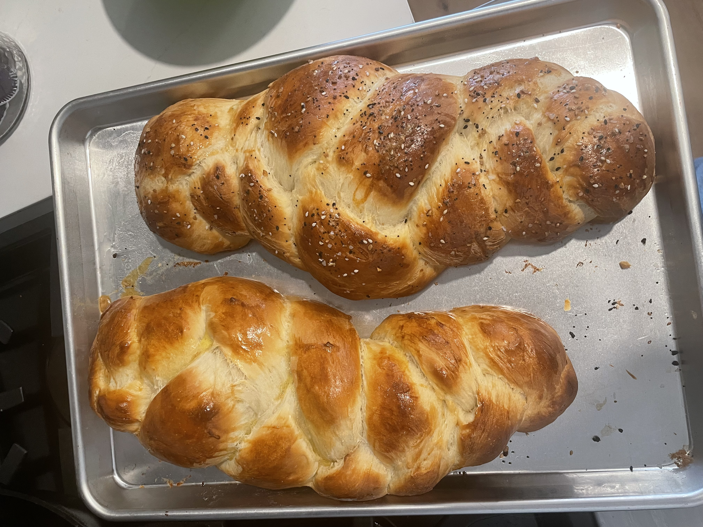

<h1 align="center">Challah</h1>  
<h3 align="center">makes 2 large challahs</h3>

## Ingredients

* 7 cups all purpose flour
* 1/2 cup sugar
* 1 tbsp salt
* 2 packets instant dry yeast
* 2 cups water
* 2 eggs
* 1/2 cup oil

1. Add 1 tsp sugar + 2 yeast packets to 2 cups of warm water (not hot)
Let stand for 3-5 minutes until it ferments (should be foamy on top)
2. Mix in the rest of the wet ingredients then add the dry, add flour one cup at a time adding the 6th cup slowly just until the dough is no longer sticky. This can be done in a stand mixer with the dough hook if you have one. 
3. Knead the dough the place in a large bowl with a cover. Let rise until doubled in size - usually around 1 hour. 
4. Brade the challahs 
5. Place on greased pan or parchment paper and let rise until double in size (usually another hour)
6. Preheat oven to 350&def;F
7. Add egg and toppings 
8. Bake challah in the oven for 30 minutes. If there is not enough room for them to be side by side in your oven - switch which one is on top at 15 minutes. Can also add more egg at that time. 

