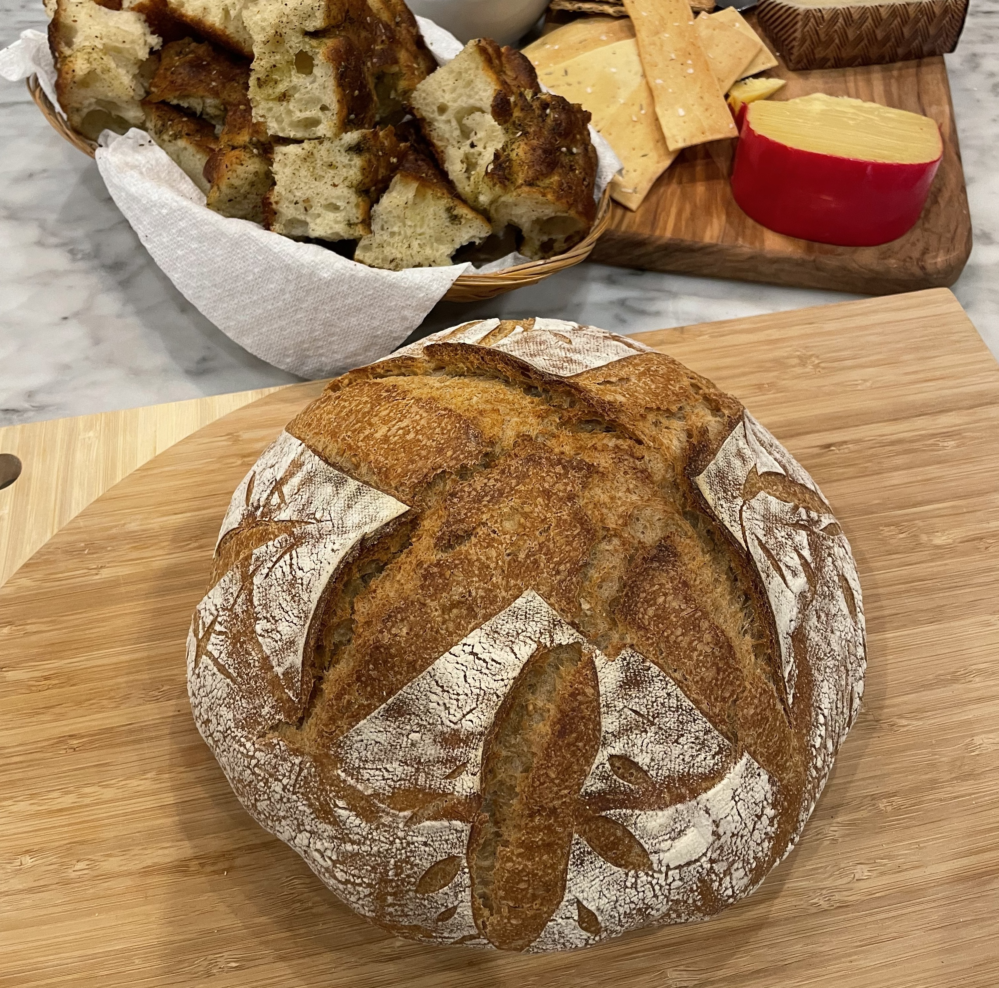

## Sourdough

- Feed the starter 50g water and 50g bread flour
- Wait for that to double in size
- Mix 500g of flour in a large bowl
- In another bowl add 350g water and then add 100g starter ( to see if starter is active watch if it floats in the water), mix the water and starter together to all be one liquid
- Add the starter and water to the 500g flour and mix with a bread whisk (not super aggressive) cover and let autolize for 45 minutes to 1 hour
- Mix 10g salt and 20-40g water
- Add that to the flour mixture, mix in
- In 30 minutes stretch and fold , do this 4 times each with a 30 minute interval
- Cover and let bulk rise (1-2hours)
- Shape the dough and add to banneton, cover and put in fridge over night (or atleast 2 hours)
- Preheat oven to 475 with Dutch oven insides
- Remove loaf from fridge and do big cut for rise. Add loaf to dutch oven
- Cook with lid on for 35 minutes
- Take lid off let brown 10-15 minutes (can lower temp if you want)
- Let loaf cool for around 1 hour before cutting

Tools/Needs:
- starter: Many local bakeries will give away or sell starter. I have a bread flour starter - if you want some just let me know.
- [baking kit](https://www.amazon.com/dp/B09HH4K1LZ/ref=cm_sw_r_as_gl_api_gl_i_B2JBFVM29JTV1F6ZJQNW?linkCode=ml2&tag=robblog0b-20) I have and have used for years. It includes banneton, dough whisk, scoring blades, metal and plastic dough scrapers and a cleaning brush.
- [food scale ](https://amzn.to/3PycUVy) 
- [dutch oven](https://amzn.to/43Agwfv) any dutch oven works, I like this one becauce I also use it for soups and stews.
- [silicon baking mat](https://amzn.to/3xcPzCE) I like to use these to avoid using parchment paper for a more sustainable option
