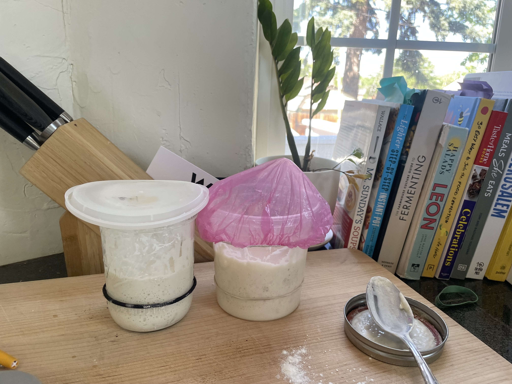

Sometimes you may not have time to bake or you're just not interested in it at the moment. I will explain how to keep your starter alive even when     you are not baking with it on a regular basis.

If you are baking you will want to:

 - Feed the starter 50g water and 50g bread flour
 - Wait for that to double in size
 - Use some of that to bake and keep the rest in your jar
 - Store the jar in the fridge totally sealed (air tight) - a mason jar can be good for this
 NOTE: if you are baking A LOT and feeding the starter every day or every other day you do not need to store starter in the fridge.

 Personally, if I am baking around once a week or every other week I will just feed my starter for the baking and do no intermediate feedings.

 You can leave a starter in the fridge for quite a long time (around 2 months in my experience) and it will be totally fine. In those scenarios you     may not get the starter doubling on your first feed and will have to repeat before you can use it to bake. In order to avoid that scenario, I rec    ommend feeding your starter around once every 2 weeks. If you are not going to bake you can just go ahead and feed the starter anyway and either m    ake a discard recipe or just toss some discard if you need room in your jar.

### Tools/Needs:

 - starter: Many local bakeries will give away or sell starter. I have a bread flour starter - if you want some just let me know.
 - [baking kit](https://www.amazon.com/dp/B09HH4K1LZ/ref=cm_sw_r_as_gl_api_gl_i_B2JBFVM29JTV1F6ZJQNW?linkCode=ml2&tag=robblog0b-20) I have and have     used for years. It includes banneton, dough whisk, scoring blades, metal and plastic dough scrapers and a cleaning brush.
 - [food scale ](https://amzn.to/3PycUVy)
